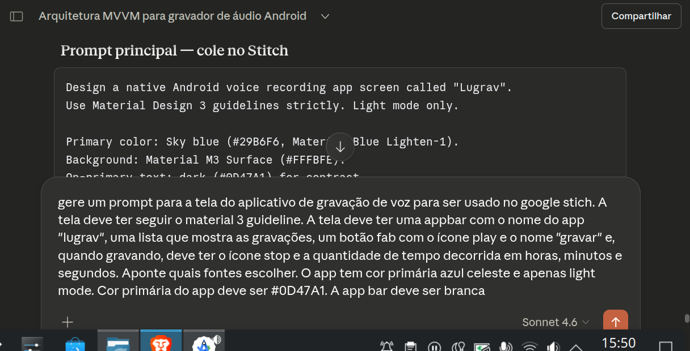
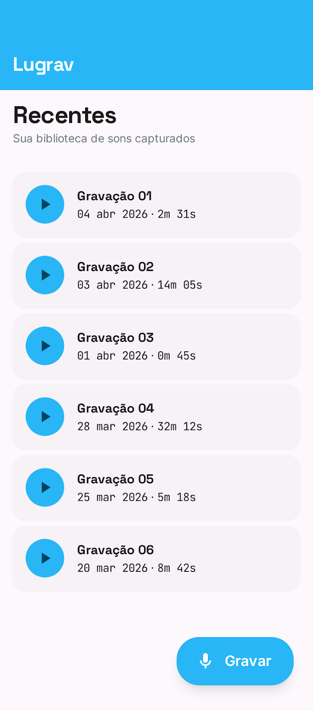
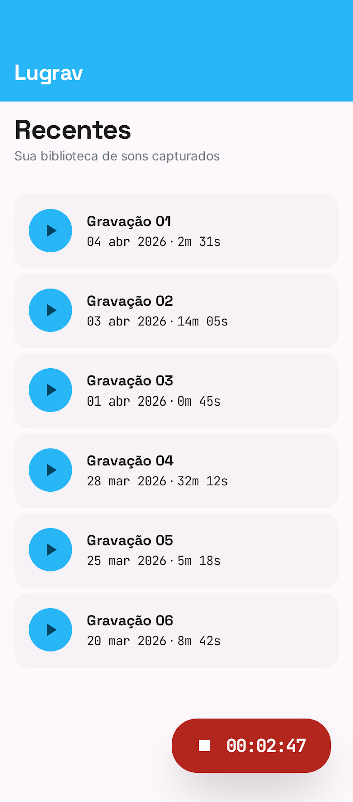
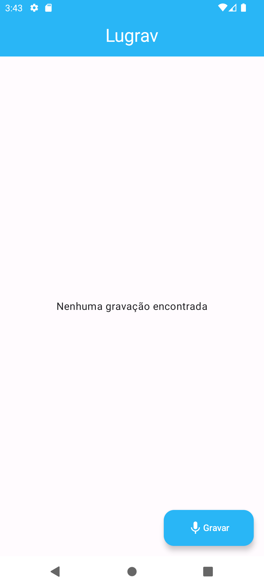
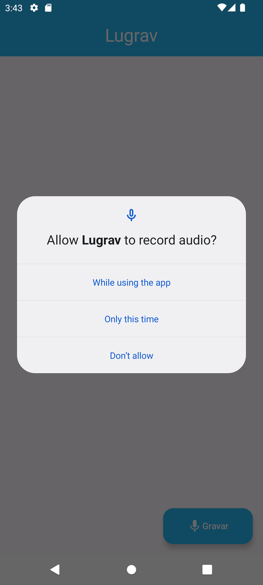
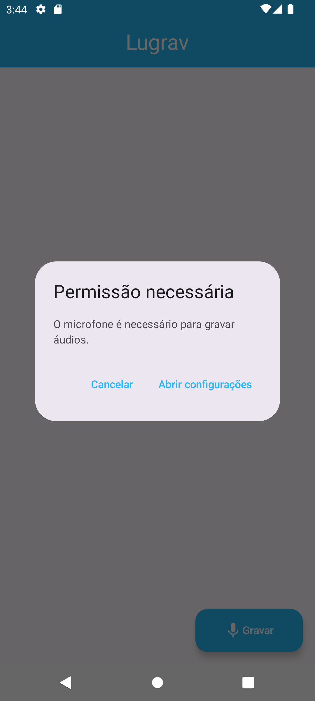
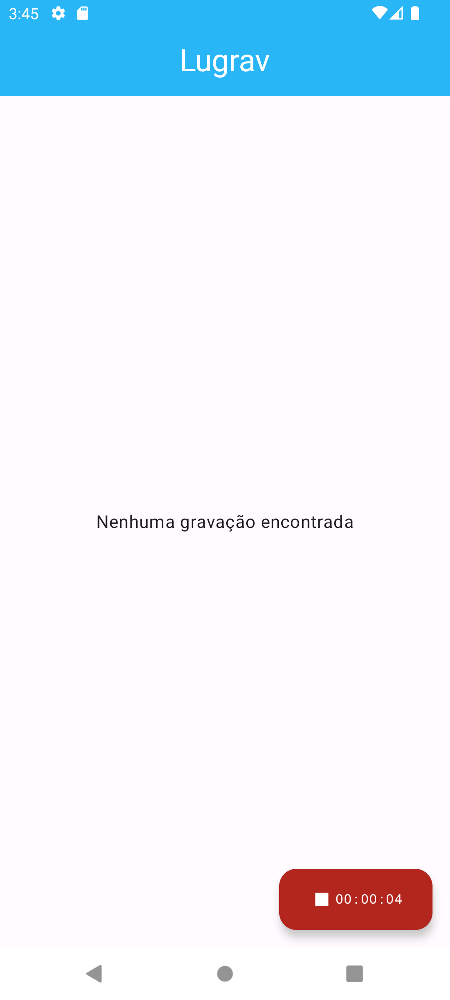
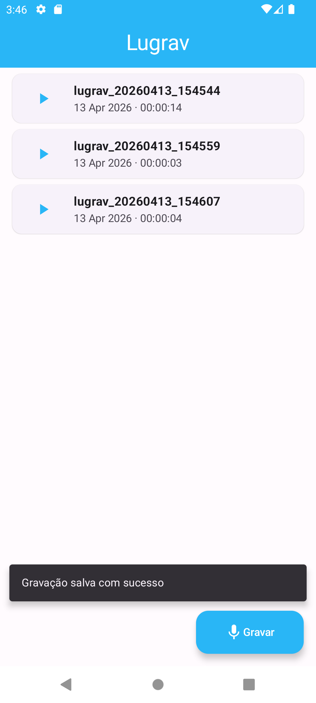

# Lugrav

## Fluxo de Desenvolvimento

Este projeto utiliza uma abordagem híbrida de IA e desenvolvimento tradicional.

A pesquisa e conceituação foi realizada com IAs conversacionais para o embasamento em conceitos, práticas de arquitetura, uso de bibliotecas e padrões de design. Isso incluiu consulta a artigos técnicos e documentação oficial do Android para refinar soluções.

Para o desenvolvimento de UI/UX, um prompt de design detalhado foi elaborado no **Claude**, seguindo os requisitos de UI e as diretrizes do Material 3. Este prompt serviu como base para o **Stich**, que foi utilizado na criação do estilo visual e na prototipagem inicial das telas. O resultado desse processo orientou a elaboração de uma experiência de usuário componentizada no Android Studio.

### Fluxo de Design

A partir de um Product Requirements Document (PRD) gerado no Claude com os requisitos do aplicativo, foi solicitada a geração de um prompt de design de tela, como descrito acima, para o Google Stich. Este prompt orientou a criação do estilo e da interface do usuário, resultando em um design que foi utilizado na elaboração da experiência de usuário componentizada.

#### Prompt de Design


Prompt de design detalhado gerado pelo Claude e que serviu como base para a criação da UI no Stich.

#### Tela de Lista de Gravações


Prototipagem da tela principal, com a lista de gravações disponíveis.

#### Tela de Gravação


Prototipagem da tela de gravação, mostrando a interface de controle da gravação.

## Ferramentas Usadas

Este projeto empregou um conjunto de ferramentas para otimizar o processo de desenvolvimento:

**Claude**: Utilizado para brainstorming, planejamento de arquitetura e para criar prompts de design detalhados que serviram como base para a criação da interface do usuário, seguindo os princípios do Material Design 3.

**Stich**: Na fase de design, os prompts gerados pelo Claude foram aplicados para a criação do estilo visual do aplicativo e a prototipagem interativa das telas, que garantiu uma representação mais fiel aos requisitos de UI.

**Opencode**: Um assistente de CLI (Command Line Interface) focado em tarefas de engenharia de software, que atuou na geração de código, refatoração e resolução de problemas, sua utilização agilizou a implementação e depuração do código.

**Android Studio**: A IDE, embora tenha atualmente ferramenta de assistência de código com IA, foi utilizada somente na codificação, depuração do projeto e testes em ambiente real.

## Arquitetura e Padrões

A arquitetura da aplicação foi planejada para garantir maior testabilidade e manutenibilidade:

**MVVM com Unidirectional Data Flow**: O ViewModel gerencia o estado da UI e a lógica de negócios, expondo-o para a View. O fluxo de dados é unidirecional, garantindo que o estado flua da fonte única de verdade (ViewModel) para a View, e as ações da View são enviadas de volta para o ViewModel para processamento.

```kotlin
class AudioRecordingViewModel(
    private val repository: AudioRecordingRepository
) : ViewModel() {
    private val _isPlaying = MutableStateFlow(false)
    val isPlaying: StateFlow<Boolean> = _isPlaying
}
```

**Repository Pattern**: Uma camada de abstração para isolar as fontes de dados (local, no caso) do restante da aplicação. Isso permite que o ViewModel interaja com os dados de forma agnóstica à sua origem, facilitando a troca de implementações de dados e a realização de testes (ainda pendentes).

**Injeção de Dependência (Koin)**: Utilizada para gerenciar as dependências entre os componentes da aplicação (ViewModels e Repository). O Koin facilitou a injeção de instâncias e a garantiu que os componentes recebessem suas dependências de forma desacoplada e testável.

## Funcionalidades

O aplicativo Lugrav permite ao usuário realizar as seguintes ações:

- **Gravar Áudio**: Iniciar e finalizar gravações de áudio.
- **Reproduzir Gravações**: Reproduzir, pausar e retomar a reprodução de áudios gravados.
- **Visualizar Gravações**: Listar todas as gravações disponíveis com seus detalhes (nome, duração, data).
- **Gerenciar Permissões**: Solicitar e gerenciar permissões de microfone de forma clara e orientada ao usuário.

### Fluxo de UX

A interface do Lugrav foi desenvolvida utilizando Jetpack Compose, seguindo um padrão de componentização para melhor modularização e reuso. Os estados de cada componente são gerenciados por um ViewModel, aderindo ao padrão MVVM e ao fluxo de dados unidirecional.

O fluxo para gravação de áudio é intuitivo, o usuário começa na tela inicial sem gravações (assim que instala o app), passando pela solicitação de permissão de microfone e tratamento de negações (conforme doc de permissões do Android Developers) e, por fim, a gravação e listagem do áudio.

#### 1. Tela Inicial (Sem Gravações, logo após instalação)

Tela inicial do aplicativo sem gravações, pronta para iniciar uma nova captura de áudio.

#### 2. Solicitação de Permissão de Microfone

Ao pressionar o botão de gravação, o aplicativo solicita permissão para acessar o microfone do dispositivo.

#### 3. Diálogo de Racionalização da Permissão

Caso o usuário negue a permissão ou selecione 'Não mostrar novamente', um diálogo é exibido, solicitando que as configurações do aplicativo sejam abertas.

#### 4. Gravação Iniciada

Após a permissão ser concedida, a gravação de áudio é iniciada e o tempo de gravação é exibido.

#### 5. Gravação Salva e Listada

A gravação é salva com sucesso, uma snackbar de confirmação é exibida e a nova gravação aparece na lista principal.

### UI/Design

A interface do usuário do Lugrav foi desenvolvida com base nos princípios do Material 3, com a adoção de componentes reutilizáveis para uma experiência mais intuitiva.

Os principais componentes criados são:

- **`LugravTopBar`**: A barra superior do aplicativo, para navegação (talvez no futuro) e título.

- **`RecordingFAB`**: O Floating Action Button para iniciar e parar gravações de áudio.

- **`RecordingCard`**: Um componente que exibe os detalhes de uma gravação específica na lista e que serve para a interação (compartilhamento, transcrição, etc) e reprodução.

- **`RecordingBottomSheet`**: Um Modal Bottom Sheet que aparece para controlar a reprodução de um áudio selecionado, incluindo o botão de play/pause e tempo de reprodução.

- **`PermissionRationaleDialog`**: Um diálogo que explica a necessidade de permissão do microfone e oferece opções para o usuário (abrir configurações ou cancelar).

## TODOS

- **Remover botão play do Recording Card**: A idé inicial era que o usuário clicasse no botão play para iniciar a reprodução. Entretanto, foi decidido usar o card como o botão e o fluxo contaraia com um componente de bottom sheet, responsavel visualmente pela reprodução.
- **Adicionar Splash Screen**: Implementar uma tela de abertura que será exibida enquanto a lista de gravações é carregada.
- **Atualizar o Ícone do Aplicativo**: Atualizar o ícone do aplicativo para uma versão personalizada.
- **Compartilhamento de Gravações**: Funcionalidade para permitir o compartilhamento de áudios gravados com outros aplicativos.

## Melhorias

- **Transcrição por IA**: Funcionalidade para transcrever o áudio gravado para texto utilizando inteligência artificial via API.